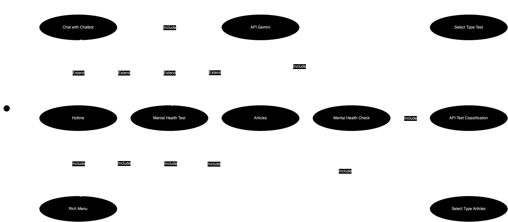

# Mr.-MH

## Description
Mr. MH Chatbot Project is a chatbot designed to perform initial mental health screening for users and provide information about mental health. The chatbot utilizes a Text Classification Model to categorize messages based on data trained related to mental health consultation. This aims to provide a preliminary mental health assessment for users.
## Use-Case


## Table of Contents
- [Features](#features)
- [Installation and Setup](#installation-and-setup)
- [Usage](#usage)
- [Bot Structure](#bot-structure)
- [API Integration](#api-integration)
- [Technical Details and Tools](#technical-details-and-tools)

## Features
- **General Q&A**: Answer general questions such as the geographical location of Thailand.
- **Mental Health Consultation**: Users can talk to the bot to determine if they may have mental health issues. If the bot detects potential mental health concerns, it will provide a link for further mental health testing.
- **Direct Mental Health Tests**: Users can directly access various mental health tests via the rich menu.
- **Contact**: Provides mental health hotline numbers.
- **Articles**: Offers articles on managing and coping with mental health issues.
- **Hint**: Can view the overall operation of the system.

## Installation and Setup

### Prerequisites
- Python 3.6 or higher
- pip (Python package installer)

### Installing Dependencies

Clone the repository and navigate into the project directory:
```bash
git clone https://github.com/BlueBonnetz/Mr.-MH.git
```

Install the required packages using pip:
```bash
pip install -r requirements.txt
```

### Setting Up the Environment
Ensure you have Python 3.6 or higher installed. You can check your Python version with:
```bash
python --version
```

### Running the API

To run the API locally, use Flask and Ngrok. Follow these steps:

1. Start the Flask API:
   ```bash
   python Text_Classification_API.py
   ```

2. In another terminal, start Ngrok to forward requests to your local server:
   ```bash
   ngrok http 9000
   ```

3. Use the URL provided by Ngrok to interact with the API.

## Usage
- Interact with the bot by typing messages through the chat interface.
- Use the rich menu to access features without typing.

## Bot Structure
- **Mental Health Check Node**: Initial consultation with the bot for mental health assessment.
- **Mental Health Test Node**: Access to mental health tests.
- **Articles Node**: Articles and knowledge on coping with mental health issues.
- **Contact Node**: Display mental health hotline numbers.

## API Integration
- **Gemini API**: Supports general conversation.
- **Text Classification API**: Processes and provides initial mental health screening for users.

## Embedding

- Perform `process_text`: remove emojis, replace multiple spaces with a single space, remove punctuation.
- Tokenization.
- Train a Word2Vec model to create Word Embeddings that convert words in the text into vectors using the average of the word vectors in the text.
- Encode labels as numeric values because some models expect labels to be numeric.


## Technical Details and Tools
- **Text Classification Model**: Utilized for message categorization.
- **Preprocessing**:
  - Load datasets using Hugging Face library.
  - Use Pythainlp for correcting misspellings (this part is optional for improving model performance).
- **Handling Imbalance Data**:
  - Address data imbalance and limited dataset issues.
  - Convert text to vectors using Word2Vec.
  - Apply Random Oversampling to handle data imbalance.
- **Vectorization**:
  - Vectorize text using Word2Vec to filter out unimportant words.
- **Label Encoding**: Convert labels to numerical values for Stacking Model.
- **Modeling**:
  - Use a Stacking Model with K-Nearest Neighbors, Random Forest, Linear Support Vector, Logistic Regression, Support Vector Machines and XGBoost.
  - Optimize parameters using Grid SearchCV.
  - Save the best model, label encoder, and vectorizer for API integration.
- **API**:
  - Run the API on localhost using Flask and Ngrok, tested with Postman.
- **Line Chatbot**:
  - Developed using Botnoid Platform in conjunction with Line Office Manager.

